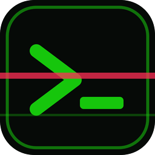
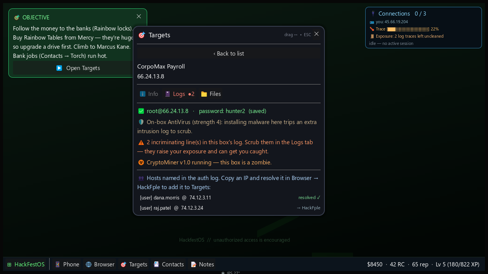
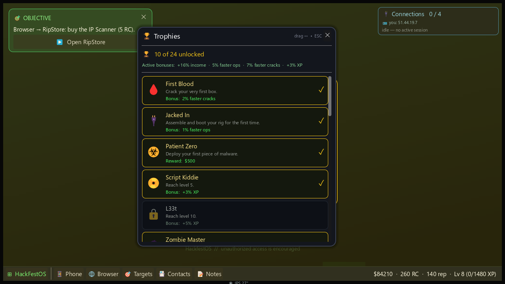
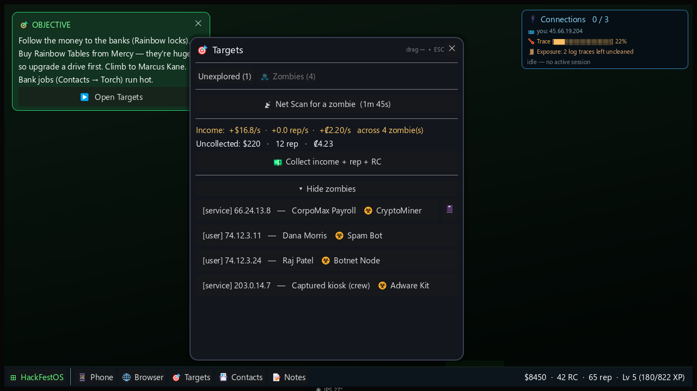
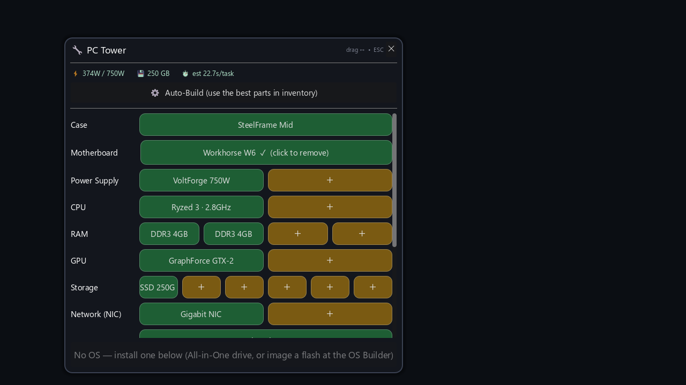
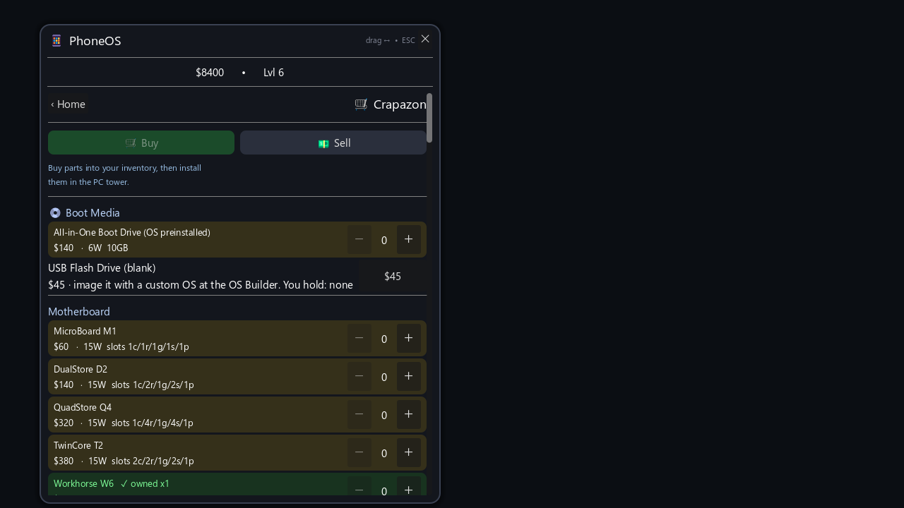
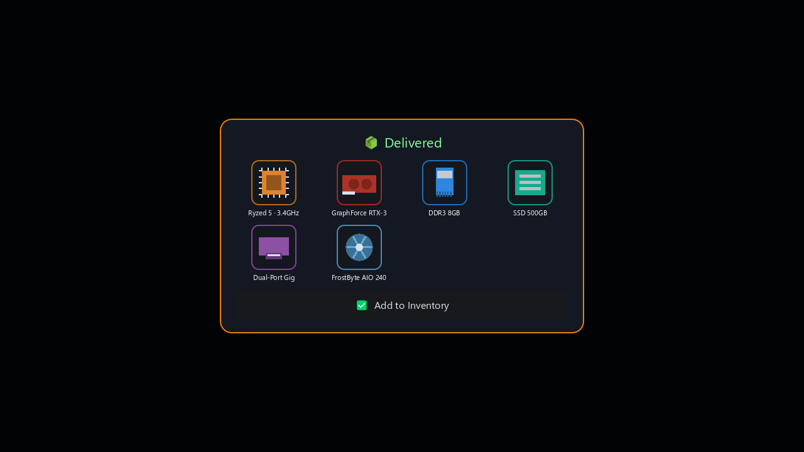
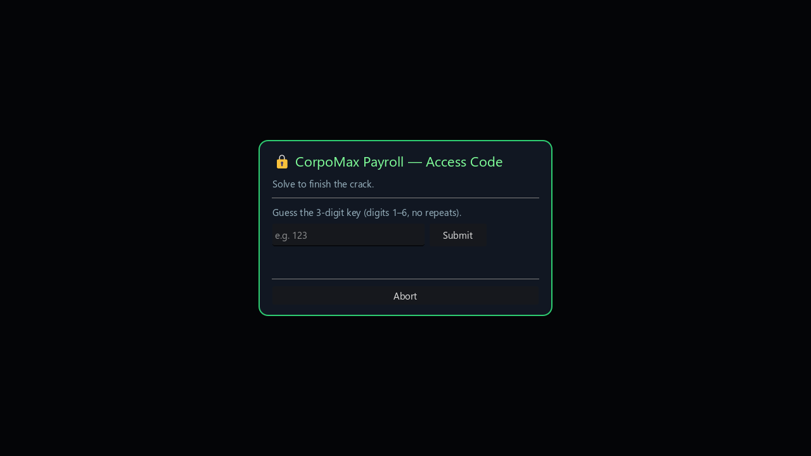

  

<h1 align="center">Hackfest</h1>

<b>A hacker-revenge sim.</b> You were fired from CorpoMax Game Softs. Build a rig, break in, and make them pay — one firewall, captcha, and zombie box at a time.

  
  
  
  
  
  

  

---

## ▶ Download & Play (Windows)

1. Open the **[latest release](https://github.com/yodahlorian/Hackfest/releases/latest)** and download **`Hackfest.exe`**.
2. **Double-click `Hackfest.exe`** and enter your **product key** to activate. No install — the
   build is one self-contained file.

> 🔑 **Need a product key?** Email **[Yodahlorian@gmail.com](mailto:Yodahlorian@gmail.com)** to request one.

> If Windows SmartScreen warns you, click **More info → Run anyway** — it's an unsigned indie
> build, not malware. Saves live under `%APPDATA%\Godot\app_userdata\Hackfest\`.

## 🌐 Play in Browser (itch.io)

Don't want to download anything? **[Play Hackfest right in your browser on itch.io »](https://deviousdevelopments.itch.io/hackfest)** — no product key, no install, no wait. A keyless Windows download is on the itch page too.

## ✦ What it is

A UI-driven "fake OS" hacking sim in the Uplink / Hacknet / Bitburner vein. Order parts, build a
PC, image an operating system onto it, boot into **HackfestOS**, and work your way through
CorpoMax's network — cracking firewalls, reading logs to trace real employees, solving puzzles, and
seeding malware that prints money while they sleep.

- 🛒 **Build & upgrade a rig** — order parts on Crapazon, assemble the tower, power it on. Better
  hardware = faster hacks, but every watt must be supplied, every gigabyte counts, and a **NIC is
  required** to get online. Hardware **unlocks act by act**, so every upgrade is a real step forward.
- 📦 **Order, unbox, build** — parts arrive as **Crapazon deliveries** you open at your desk;
  **sell** old gear back for cash; and one-tap **Auto-Build** fills the tower with the best parts you
  own, flagging anything missing or underpowered.
- 💿 **Install & upgrade an OS** — start with an **all-in-one boot drive**, then build a custom
  **HackfestOS** at the OS Builder: image a blank flash, install it to a drive, or clone it to a
  bigger one. Each OS tier grants **more connections, faster ops, more income, a quieter trace, and
  extra storage** — swap the drive it lives on and you'll have to reinstall.
- 🧭 **A full campaign with an ending** — from your revenge on CorpoMax, through **CorpoMax HQ** and
  the **banks**, to the one pulling the strings. Story beats and characters carry you between hacks.
- 🗂 **Every box is a workspace** — crack one and it opens into tabs: **Info** (access, malware,
  who logs in from where), **Logs** (scrub the trail you left), and **Files** (the loot).
- ☣ **A malware arsenal, paid by the victim's hardware** — every box you enslave runs on its **own
  rig**, and income scales with it: **Spam** (CPU/RAM) and **Adware** (RAM) print cash, **Torrent**
  (bandwidth) earns rep, **Botnet** rents its NIC, a **CryptoMiner** turns its GPU into RipCoin, a
  **Data Scraper** fills its disk and sells the dump, and **Ransomware** cashes out one box in a
  single hit — then bricks it.
- 🔓 **Multiple crack families** — firewalls aren't all SSH. **Hash** and **Rainbow** locks need
  their own looted cracker ladders (rainbow tables are huge — watch your disk); a universal
  **Brute Forcer** handles low-tier boxes.
- 🕵 **Detection, tracing & antivirus** — **every action leaves a log**, and every incriminating line
  you don't scrub raises your **exposure**. Hardened boxes run their own **antivirus** that fights
  back; run hot too long and your **IP gets burned** — buy a clean identity with rep. Your own AV and
  a cooler buy you time.
- 📇 **Contacts & jobs** — fixers post contracts that pay **cash, rep, and free zombie boxes**; spend
  rep at a black-market **store** for gear like **Aquawall** that speeds your cracks.
- 📓 **Logs trace to people** — crack a server and its auth log names the **[service]** hosts and
  **[user]** staff behind it. Resolve them in HackFple; their boxes hold the loot and the next cracker.
- 🧩 **Puzzles & captchas** — every box throws a security challenge (**12 kinds**). Encrypted files
  guard the best software behind a harder one.
- 🏆 **Achievements with teeth** — **24 trophies** that actually pay off. Most grant a small
  **permanent bonus that stacks** — faster cracks, more income, a quieter trace, extra connections —
  and campaign milestones drop **one-time bounties** (cash, RipCoin, free zombie boxes). A 🏆 Trophies
  app tracks them all; a few stay **secret** until you earn them.
- 💾 **Power & storage economy** — cracks draw power; every download is a **timed transfer over your
  NIC**, and rainbow tables eat drive space. Outgrow your rig and you'll power down to swap in bigger
  drives, PSUs, and CPUs. Uninstall software you no longer need to reclaim the space.
- 📝 **Keep notes** — a built-in Notepad (saved with your game) for the IPs, passwords, and ladders.

## 📸 Screenshots

  

|  |  |
|---|---|
|  |  |
|  |  |
|  |  |

## 🧪 This is a beta — tell me what breaks

Please open an **[Issue](https://github.com/yodahlorian/Hackfest/issues/new)** for anything: crashes,
softlocks, confusing tutorials, wild difficulty spikes, or a number that feels off. Balance
(income, trace, ladder lengths, OS/hardware pricing) is first-pass and being tuned from playtest.

## ⚙ Under the hood

Built in **[Godot 4.3](https://godotengine.org)**. Single self-contained Windows executable with an
embedded pack — no runtime, no dependencies. Saves are plain JSON under `user://`.

---

Hackfest is a work of fiction. Hack the fictional CorpoMax, not real people. 🖤

